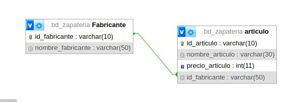
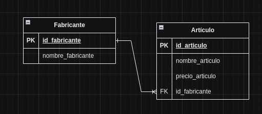
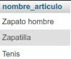

# sistemas para una zapateria 

## Modelo Entidad_relacion

## Modelo Fisico de la BD

## tabla fabricante

## articulo 

## consultas a la bd

1. Mostrar la lista de todos datos de los fabricantes

`SELECT * FROM fabricante;`

2. Mostrar la lista de nombres de los fabricantes 

`SELECT nombre_fabricante AS fabricante FROM fabricante;`

3. Mostrar los nombres de los productos.

`SELECT nombre_articulo FROM * articulo`

4. mostrar los precios de los nombres de los productos

`SELECT nombre_articulo AS Nombre, precio_articulo AS Precio FROM Articulo;`

5. Obtener los nombres de los articulos cuyo precio es mayor que 50000

6. Obtener los nombres de los articulos cuyos precio estan entre 5000 y 40000

### Forma 1

`SELECT nombre_articulo FROM Articulo WHERE precio_articulo >=5000 AND precio_articulo <=40000;`

### Forma 2

`SELECT nombre_articulo FROM Articulo WHERE precio_articulo BETWEEN 5000 AND 40000;`
